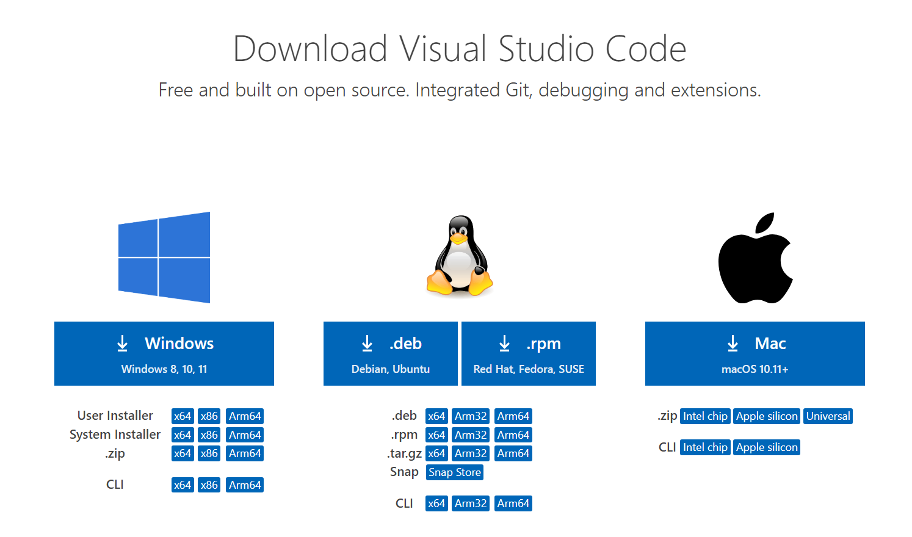
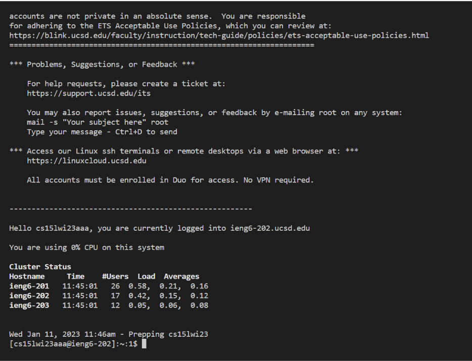
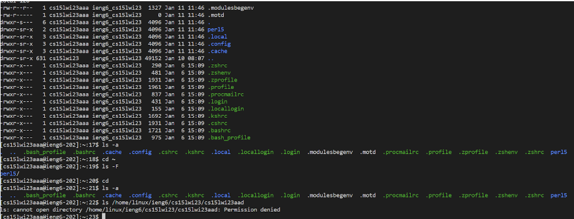

# Lab Report 1

## Step 1: Installing VSCode

In order to do this lab, you first need to install VSCode onto your computer, and additionally install Git if you are using Windows.

1. Install VSCode

2. Download Git for Windows if on a Windows machine
3. Open a VSCode window

## Step 2: Remotely Connecting

After installation, you need to remotely connect to your UCSD Lab email.

1. Go to [https://sdacs.ucsd.edu/~icc/index.php](https://sdacs.ucsd.edu/~icc/index.php) in order to change your cse lab email.
2. Once your email password is changed, open VSCode.
3. On the top, click Terminal -> New Terminal and then type in "ssh cs15lwi23(your course specific letters here like aa)@ieng6.ucsd.edu"

## Step 3: Trying Some Commands

Once you are connected, you can try out some commands in the command line.

1. Explore your current directory by typing ls, or ls -F, or ls -a
2. Try out other commands such as mkdir, cd, pwd.
3. Try combining some commands such as using ls -lat

