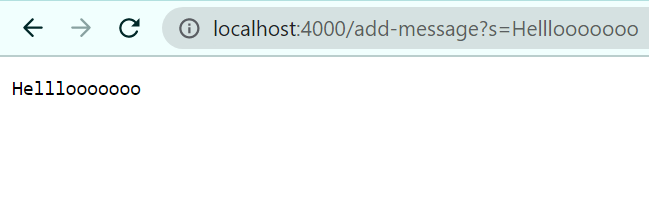
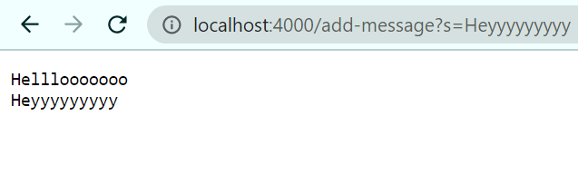
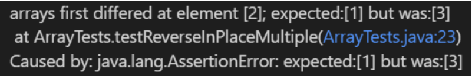

# Lab Report 2

## Part 1
Code for StringServer
```
import java.io.IOException;
import java.net.URI;

class Handler implements URLHandler {
    String homepage = "";

    public String handleRequest(URI url) {
        if (url.getPath().equals("/")) {
            return homepage;
        } else {
            System.out.println("Path: " + url.getPath());
            if (url.getPath().contains("/add-message")) {
                String[] parameters = url.getQuery().split("=");
                if (parameters[0].equals("s")) {
                    homepage += parameters[1] + "\n";
                    return homepage;
                }
            }
            return "404 Not Found!";
        }
    }
}

class StringServer {
    public static void main(String[] args) throws IOException {
        if (args.length == 0) {
            System.out.println("Missing port number! Try any number between 1024 to 49151");
            return;
        }
        int port = Integer.parseInt(args[0]);
        Server.start(port, new Handler());
    }
}
```


When first loading the web server, the main method is called. Then, when loading the webpage onto the browser, the handleRequest method is called. The relevant arguments for the main method is the port number in the command line, and the relevant argument for the handleRequest method is http://localhost:4000/add-message?s=Helllooooooo. In the command line argument, the port number 4000 is converted from a String to an int value. For the handleRequest method, the argument is changed from an URI to a String value.



The handleRequest method is called. The relevant arguments for the handleRequest method is http://localhost:4000/add-message?s=Heyyyyyyyyy/. In the handleRequest method, the argument is changed from an URI to a String value.


## Part 2

Faulty Program chosen : 
```
static void reverseInPlace(int[] arr) {
    for(int i = 0; i < arr.length; i += 1) {
      arr[i] = arr[arr.length - i - 1];
    }
}
```
Input that causes an error :
```
public void testReverseInPlaceMultiple() {
    int[] input1 = {1,2,3};
    ArrayExamples.reverseInPlace(input1);
    assertArrayEquals(new int[]{3,2,1}, input1);
}
```
Input that does not cause an error : 
```
public void testReverseInPlace() {
    int[] input1 = { 3 };
    ArrayExamples.reverseInPlace(input1);
    assertArrayEquals(new int[]{ 3 }, input1);
}
```
The Symptom : <br>
 <br> 
Before : 
```
static void reverseInPlace(int[] arr) {
    for(int i = 0; i < arr.length; i += 1) {
      arr[i] = arr[arr.length - i - 1];
    }
}
```
After :
```
static void reverseInPlace(int[] arr) {
    for (int i = 0; i < arr.length/2; i++) {
        int temp = arr[arr.length/2-1];
        arr[i] = arr[arr.length-i-1];
        arr[arr.length-i-1] = temp;
        System.out.println(arr[i]);
    }
}
```
The fix addresses the issue by properly saving the element switched while parsing through the array. Before the fix, the array was [3, 2, 3] as the value 1 never got saved and when referencing what index 2 should be, it chooses 3 as that is what index 0 currently is. After the fix, the array outputs to [3, 2, 1] as the value 1 gets saved in a temporary variable called "temp" and is able to be properly reversed.

## Part 3

One thing I learned from lab 2 that I did not know before was how to start my own web server using VSCode. I also did not know how to manipulate the port number, as well as being able to put parameters into the address line that actually influences what happens on the web page.
