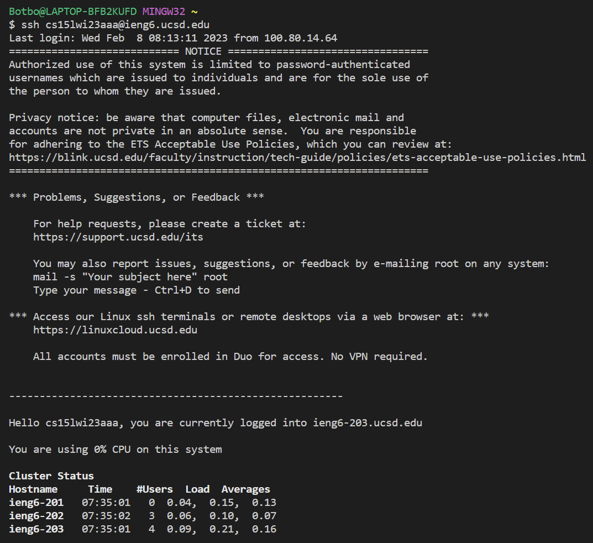
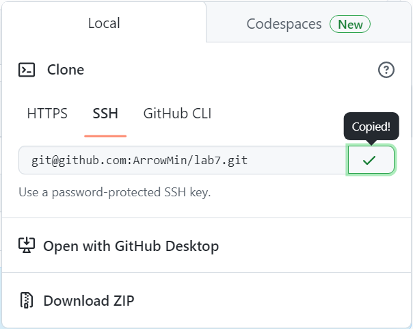
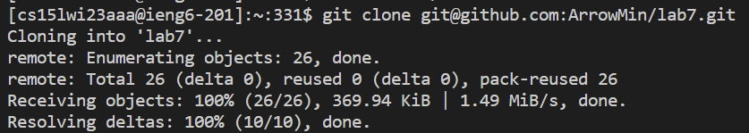
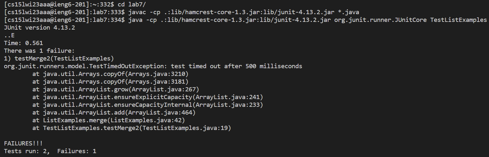

# Lab Report 4

## Step 4 :

First, I typed in `ssh cs15lwi23aaa@ieng6.ucsd.edu`

## Step 5 :

Then I went onto the lab 7 repo fork I created on GitHub, and pressed the copy button for the SSH link.

Then, I typed in `git clone <ctrl> + <shift> + <V>` in order to paste the copied ssh link.

## Step 6 :

After that, I typed in `cd lab7/` in order to switch to the lab7/ directory. Then I typed in `javac -cp .:lib/hamcrest-core-1.3.jar:lib/junit-4.13.2.jar *.java` in order to compile all the Java files. Finally, I typed in `java -cp .:lib/hamcrest-core-1.3.jar:lib/junit-4.13.2.jar org.junit.runner.JUnitCore TestListExamples` in order to run the tester.

## Step 7 :

In order to fix the bug, I typed in `sed '43 s/index1/index2/' ListExamples.java -i` to change the line with a bug.

## Step 8 :

To run the tests again, I pressed `<ctrl> + <R>` to bring up the previous commands I entered then typed in `javac <enter>` which autocompleted the previous compile command I typed in earlier. To run the tester again, I did `<ctrl> + <R>` again and then typed in `java -c<enter>` to autocomplete the test runner.

## Step 9 :

To add all the changes I typed in `git add .`, then I typed in `git commit -m "Fix Bug"`, and then I typed in `git push` to save all the changes to GitHub.
