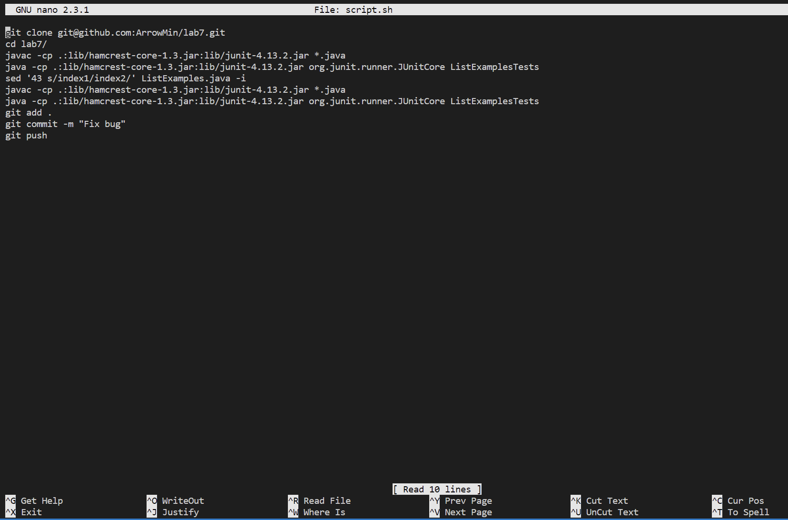

# Lab Report 5

I decided to go with lab report 4 for my re task as I feel like this lab was where I was able to learn the most throughout all of the labs. I was able to learn many things such as the `sed` command as well as using `<CTRL> + <R>` in order to reverse search previously used commands.

First, I ssh'd into the ieng6 server on my lab account using `ssh cs15lwi23aaa@ieng6.ucsd.edu`, then I removed the currently existing /lab7 directory by typing `rm -rf lab7`

On GitHub, I deleted my currently existing fork of the lab7 as I had already pushed my previous changes to it. I deleted the fork and then made a fresh fork by going to the lab 7 repo and making a new fork.

Then, I created a bash script which would contain all the commands from the lab 4 report using `touch script.sh`, and then entered the nano editor by doing `nano script.sh`

Once inside the nano editor, I wrote down all the commands from the previous lab report into the bash script as so

Then, in order to do the entire lab report, all I had to do was run `bash script.sh` and the entire challenge was done within seconds

Overall, I feel like these labs have been a great use of time as although I had believed I was decent at bash, I clearly was just learning as I did not know about very useful commands like `<CTRL> + <R>`, `sed`, or even how to make a bash script.

